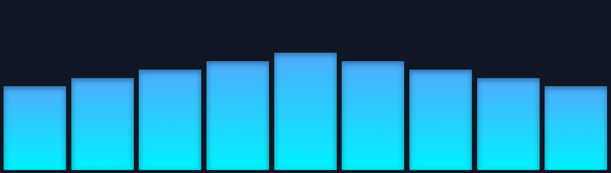

# GSAP Panel Fall Animation

A simple animation using **GSAP** where 9 panels (divs) first expand in width and then "fall" down to the bottom of the container.



## Demo

- Container: full width, height `50vh`
- 9 panels with fixed heights in percentages of the container
- Panels start with `scaleX: 0` (width 0) and expand to their final width
- After that, they fall down with a small stagger while keeping their height

## Technologies

- **HTML / CSS / JavaScript**
- **GSAP 3** for animation (`scaleX` for width expansion and `y` for falling)
- Flexbox layout with `gap` for spacing

## Parameters

In the script you can easily adjust the duration and timing:

```js
const WIDTH_DURATION = 1; // duration of width animation
const WIDTH_STAGGER = 0.1; // delay between panels during expansion
const FALL_DURATION = 0.6; // duration of the fall
const FALL_STAGGER = 0.02; // delay between panels during falling
```
